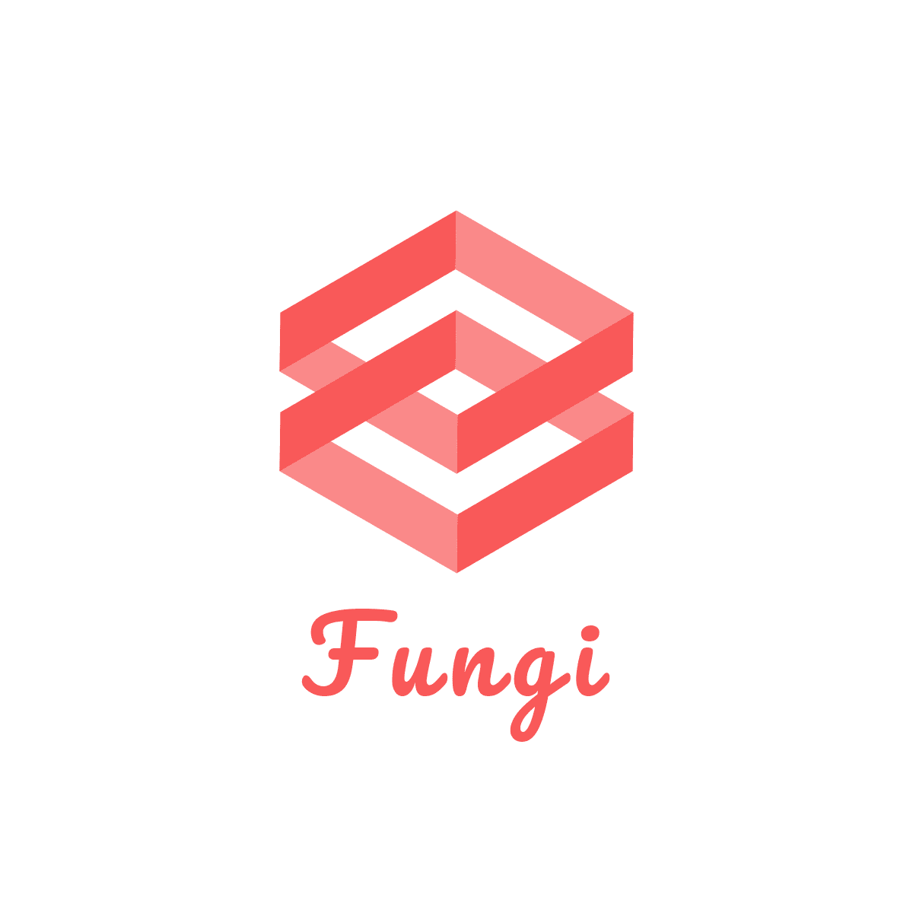

<p align="center">
  
</p>

<p align="center">
  <a href="https://www.npmjs.com/package/@fungi-realtime/core" target="_blank">
    
  </a>

  <a href="https://github.com/FungiRealtime/fungi-js/actions/workflows/main.yml">
    
  </a>
</p>

<p align="center">Core Javascript API for interacting with a Fungi cluster on the browser and Node.</p>

## Features

- **Resilient & stable**. Automatic reconnection of websocket connection upon unexpected errors, health checks and more to keep the user always online.
- **Environment agnostic**. Works on both the browser and Node, the native [WebSocket](https://developer.mozilla.org/en-US/docs/Web/API/WebSocket) API will be used on browsers and [ws](https://github.com/websockets/ws) on Node.

## Installation

This module is distributed via [npm](https://npmjs.com/) which is bundled with [node](https://nodejs.org/) and should be installed as one of your project's `dependencies`:

```
npm install @fungi-realtime/core
```

## Usage & Docs

See the [official documentation](https://fungirealti.me/docs/node).
